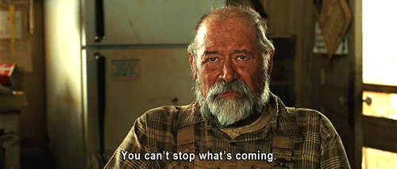
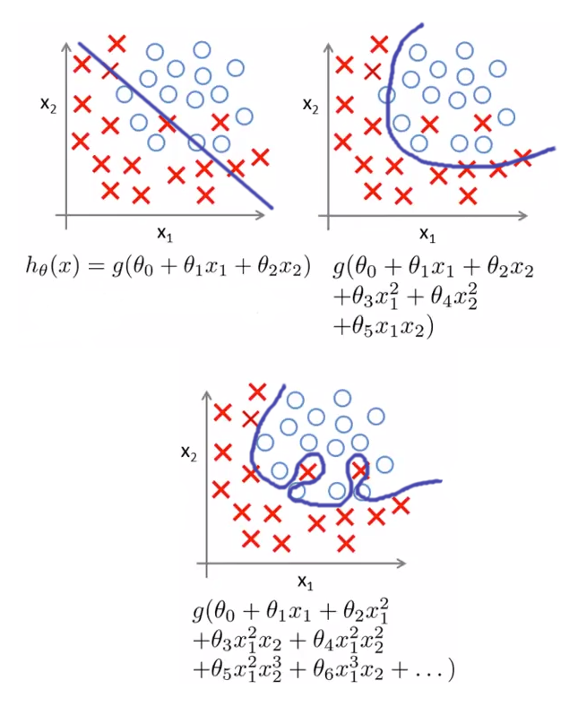

# Are those . . . more bias / variance conceptual questions??



### Before looking at the solution branch, check your answers against 
### someone else in the cohort


#### Fill in the following blanks for definitions of `bias` and `variance`

We have a situation where we have multiple samples and one algorithm.

For each sample, we train the algo on that sample, then make a prediction
for a single new observation the algo wasn't trained on

Let's define 'bias' and 'variance' in terms of the different predictions 
generated by the algo trained on different samples.

**Bias**: bias refers to the average _________

If we had a model with low bias, 
the average ________ would _________

If we had a model with high bias,
the average _________ would ________


**Variance**: variance refers to the average _________

If we had a model with low variance, 
the average ________ would _________

If we had a model with high variance,
the average ________ would _________


```python
'''
Your answers here

Bias:

Variance:  
'''
```

#### What is "overfitting"?  What is "underfitting"?

Bonus points for including discussion of "irreducible 
error" in how overfitting occurs


```python
'''
Your answers here
'''
```

#### Discuss how underfitting relates to bias and/or variance

#### Discuss how overfitting relates to bias and/or variance


```python
'''
Your answers here
'''
```

#### How do we diagnose overfitting and underfitting?


```python
'''
Your answers here
'''
```

#### What are some techniques to mitigate over- and underfitting?


```python
'''
Your answers here
'''
```

### Consider this graphic



Which is the most **complex** model?

Which is the most **underfit** model?

Which will have the **worst** training metrics?

Which will have the **largest difference** 
in training and testing metrics?


```python
'''
Your answers here
'''
```
